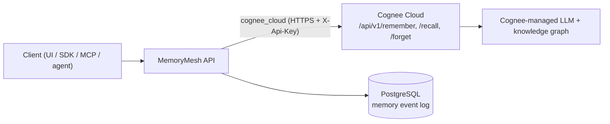

# Cognee Cloud mode

This is the **Best Use of Cognee Cloud** prize path.

MemoryMesh uses the Cognee Cloud tenant URL and API key to run the same memory lifecycle against managed Cognee Cloud. The API reports `fallback_used` and per-operation status so Cloud gaps are visible instead of hidden.

## Technical flow



The LLM/graph reasoning runs **server-side in Cognee Cloud** (authenticated by `COGNEE_API_KEY`); MemoryMesh records each operation in its own PostgreSQL event log. A successful call returns `provider=Cognee Cloud` with `fallback_used=false`.

## Configure

```bash
cp .env.cloud.example .env
```

Required settings:

```env
MEMORYMESH_MEMORY_BACKEND=cognee_cloud
COGNEE_ENABLED=true
COGNEE_SERVICE_URL=https://your-tenant.cognee.ai
COGNEE_API_KEY=your-cognee-cloud-api-key
COGNEE_DEFAULT_DATASET=memorymesh-agent-work-memory
```

## Run

```bash
docker compose up --build
```

Then:

```bash
./scripts/demo_cognee_cloud.sh
```

## Use it (developers)

Select Cloud memory per request with `"backend": "cognee_cloud"` (or set `MEMORYMESH_MEMORY_BACKEND=cognee_cloud` as the server default):

```bash
curl -X POST "$API/api/memory/remember" -H 'Content-Type: application/json' \
  -d '{"backend":"cognee_cloud","dataset":"repo-memory","text":"Dashboard RBAC guard lives in the central middleware."}'

curl -X POST "$API/api/memory/recall" -H 'Content-Type: application/json' \
  -d '{"backend":"cognee_cloud","dataset":"repo-memory","query":"where does the RBAC guard live?"}'
```

SDK (`default_memory_backend="cognee_cloud"`) and MCP (`MM_MEMORY_BACKEND=cognee_cloud`) usage is in [`SDK_INTEGRATION.md`](SDK_INTEGRATION.md) and [`CONNECTED_AGENTS_MCP_API_SDK.md`](CONNECTED_AGENTS_MCP_API_SDK.md); full endpoint reference is in [`API_REFERENCE.md`](API_REFERENCE.md). Check readiness with `GET /api/memory/status?backend=cognee_cloud&probe=true` (expect `ready=true`, `fallback_used=false` on lifecycle calls).

## What judges should see

- Backend label: `Cognee Cloud`
- Backend mode: `cognee_cloud`
- Cloud status: service URL and API key configured
- Same agent workflow as open-source mode
- Same lifecycle trace: `remember -> recall -> improve -> forget`
- If the tenant does not expose native `improve`, MemoryMesh stores an improvement note and reports `improvement_note_stored` rather than pretending native improve succeeded
- No product/UI change between local and cloud modes
