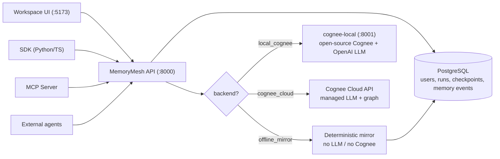
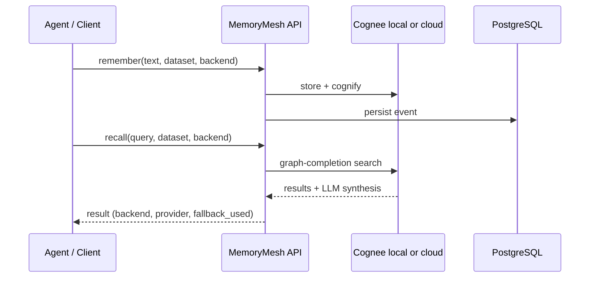

# MemoryMesh Repository Architecture

MemoryMesh is organised as a clean monorepo so infrastructure and example agents can evolve independently.

## Core infrastructure

- `services/api`: FastAPI service exposing run, event, checkpoint, recovery, memory, and system-status endpoints.
- `packages/sdk-python`: Python client for agent developers.
- `packages/sdk-typescript`: TypeScript client for web/Node agent developers.
- `apps/console`: infrastructure console for operators and judges.

## Example agent

- `examples/ticket-investigation-agent`: reference domain agent showing how to call the SDK/API.
- `apps/coding-agent-demo`: ChatGPT-style UI for the example agent.

## Separation principle

The agent consumes MemoryMesh through SDK/API contracts. It should not depend on private internals of the core runtime service.

## Technical flow

Clients (workspace UI, SDK, MCP, or external agents) call the MemoryMesh API. A backend router selects the memory backend per request, and every operation is recorded in PostgreSQL.

### Memory lifecycle

### Backends at a glance

| Mode | Path | LLM | Data location |
|---|---|---|---|
| `offline_mirror` | API → PostgreSQL | none | your DB |
| `local_cognee` | API → `cognee-local` (:8001) → open-source Cognee | your OpenAI key | your infrastructure |
| `cognee_cloud` | API → Cognee Cloud HTTPS API | Cognee-managed | Cognee Cloud (+ event log in your DB) |

Per-mode diagrams are in the [README](../README.md#architecture--memory-mode-flows), [`COGNEE_CLOUD_MODE.md`](COGNEE_CLOUD_MODE.md), and [`OPEN_SOURCE_COGNEE_MODE.md`](OPEN_SOURCE_COGNEE_MODE.md).
